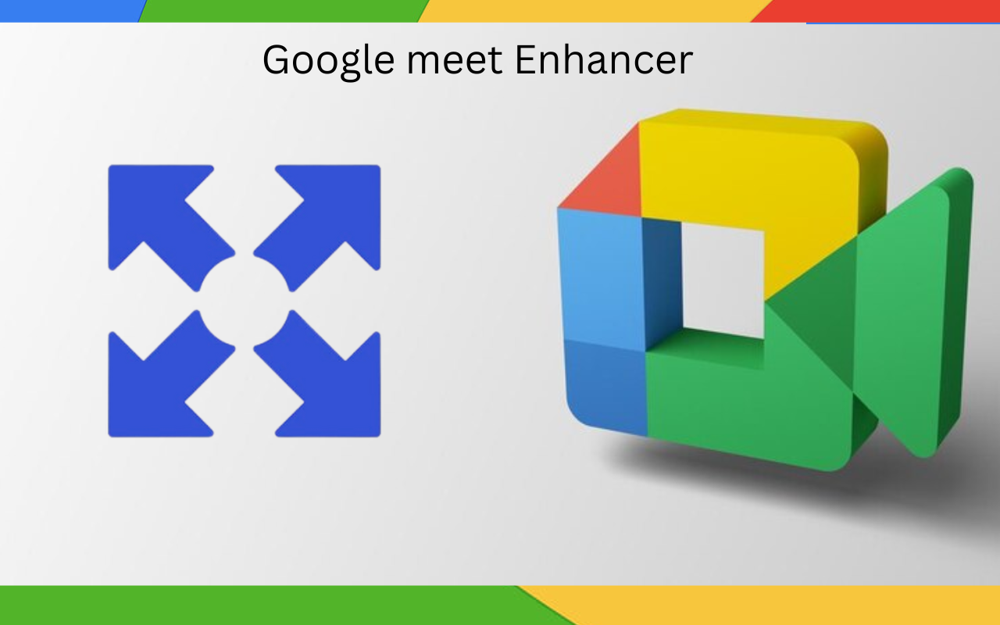
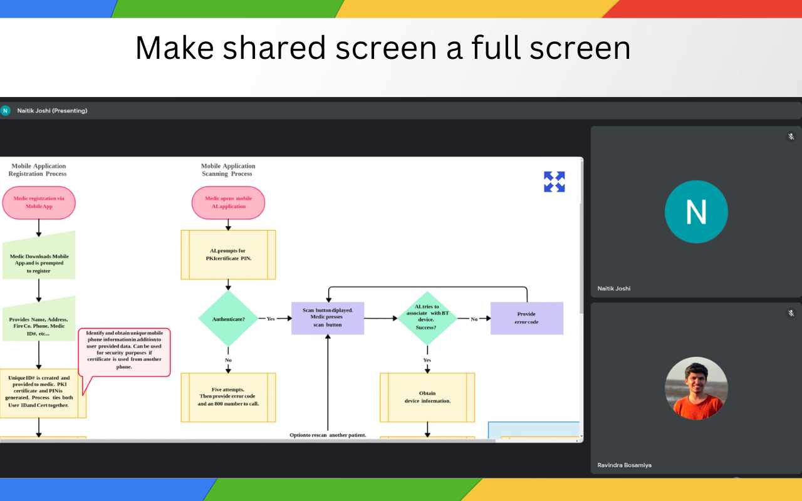

# **Meet Fullscreen Enhancer**

## **Overview**  
Meet Fullscreen Enhancer is a simple yet powerful Chrome/Edge extension that enhances your Google Meet experience. It automatically adds a "Fullscreen" button to all videos and shared screens during meetings, allowing you to easily focus on the content that matters. Whether you're watching a presentation or interacting with multiple participants, this extension gives you greater control over your viewing experience.

---

## **Features**  
- Adds a "Fullscreen" button to each video and shared screen in Google Meet.  
- Works seamlessly without interfering with Google Meet’s default features.  
- Lightweight and easy to use.

---

## **How to Install and Use**

### **Step 1: Download the ZIP File**  
1. Click the **[Download ZIP](/google-meet-enhancer-v0.1.zip)** link (replace this with the actual link when available).  
2. Extract the contents of the ZIP file to a folder on your computer.

### **Step 2: Load the Extension in Chrome/Edge**  
1. Open your browser and navigate to the **Extensions** page:  
   - **For Chrome**: Go to `chrome://extensions/`.  
   - **For Edge**: Go to `edge://extensions/`.  

2. Enable **Developer Mode**:  
   - Look for the "Developer mode" toggle in the top right corner of the page and enable it.  

3. Click **Load unpacked**:  
   - Select the folder where you extracted the ZIP file.  

4. The extension will now be added to your browser. You’ll see its icon in the extensions bar.

### **Step 3: Use the Extension in Google Meet**  
1. Open Google Meet (`https://meet.google.com`).  
2. Join or start a meeting.  
3. Observe the "Fullscreen" button overlaying all videos and shared screens.  
4. Click the button to toggle fullscreen mode for the selected video or shared screen.

---

## **Screenshots**  
###  Fullscreen Button on Shared Screen**  

 

---

## **Feedback and Support**  
If you encounter any issues or have suggestions, feel free to reach out. Your feedback helps us improve!
Feel free to email me at rbosamiya9@gmail.com

---